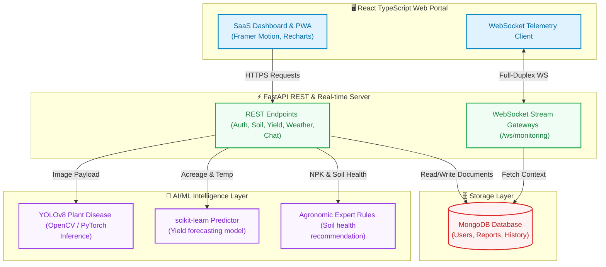

<div align="center">
  

  # 🌱 AgriNexus AI

  ### *Next-Generation Smart Agriculture Decision Support & Intelligence Engine*

  <br />

  <!-- Tech Stack Badges -->
  [](https://fastapi.tiangolo.com)
  [](https://react.dev)
  [](https://www.typescriptlang.org)
  [](https://tailwindcss.com)
  [](https://www.mongodb.com)
  [](https://www.python.org)

  <!-- Status & Meta Badges -->
  [](LICENSE)
  [](https://github.com/abakaushik-lgtm/SmartAgricultureIntelligenceSystem/pulls)
  [](https://github.com/abakaushik-lgtm/SmartAgricultureIntelligenceSystem)
  [](https://github.com/abakaushik-lgtm/SmartAgricultureIntelligenceSystem/fork)
  [](https://github.com/abakaushik-lgtm/SmartAgricultureIntelligenceSystem/commits)
  [](https://github.com/abakaushik-lgtm/SmartAgricultureIntelligenceSystem)

  <br />

  *Empowering modern growers with real-time sensor telemetry, AI-driven crop disease diagnostics,<br/>agronomic yield predictions, and weather-aware decision networks.*

  <br />

  ---

  **[🌍 Problem](#-the-problem)** · **[✅ Solution](#-our-solution)** · **[✨ Features](#-features)** · **[🖼 Screenshots](#-screenshots)** · **[🛠 Tech Stack](#-technology-stack)** · **[🚀 Setup](#-installation-guide)** · **[🎬 Demo](#-live-demo)** · **[🔮 Future](#-future-enhancements)**

  ---

</div>

<br />

<!-- ╔═══════════════════════════════════════════════════════════════════╗ -->
<!-- ║  1. PROBLEM                                                       ║ -->
<!-- ╚═══════════════════════════════════════════════════════════════════╝ -->

<div align="center">

## 🌍 The Problem

</div>

> **Indian agriculture feeds 1.4 billion people — but still runs on guesswork.**

<div align="center">

| Statistic | Impact |
| :---: | :--- |
| **70%** | of farmers can't identify crop diseases early — losing **₹50,000+/acre** in treatable outbreaks |
| **60%** | over-apply fertilizers with no soil testing — wasting **₹35,000 crore/year** nationally |
| **85%** | of smallholder farmers lack access to weather-adjusted planting guidance |
| **30-50%** | yield gap between India and global benchmarks due to reactive farming |
| **₹1.25L Cr** | worth of produce lost annually to preventable, diagnosable causes |

</div>

<br />

<div align="center">

### 💡 *The root cause isn't a lack of farming skill — it's a lack of farming intelligence.*

</div>

<br />

<!-- ╔═══════════════════════════════════════════════════════════════════╗ -->
<!-- ║  2. SOLUTION                                                      ║ -->
<!-- ╚═══════════════════════════════════════════════════════════════════╝ -->

<div align="center">

## ✅ Our Solution

*AgriNexus AI replaces guesswork with **data-driven precision agriculture** —<br/>giving every farmer access to the same intelligence tools used by large agri-corporations.*

</div>

<br />

<div align="center">

| Farmer's Problem | What They Get Today | What AgriNexus AI Gives Them |
| :--- | :---: | :--- |
| "My leaves have spots" | ❌ Guess or lose the crop | 🦠 **AI leaf scan** → diagnosis + treatment in seconds |
| "Is my soil healthy?" | ❌ Expensive lab test (7 days) | 🌱 **Instant soil scoring** → NPK, pH, moisture with amendments |
| "How much fertilizer?" | ❌ Guesswork or over-apply | 💊 **Smart advisor** → exact product, kg/acre, timing by crop stage |
| "What will my yield be?" | ❌ Hope for the best | 📊 **ML prediction** → tons forecast with confidence % |
| "Will it rain this week?" | ❌ Check generic weather app | 🌦 **7-day agri-forecast** → planting/harvesting decisions |
| "What should I do next?" | ❌ Ask neighbors, hope | 🤖 **AI assistant** → 24/7 personalized guidance |

</div>

<br />

<div align="center">

> **Every API response is designed to answer one question:** *"What should I do next?"*
>
> That's what separates a data dashboard from a **decision engine**.

</div>

<br />

### 📋 Sample Outputs — Real API Responses

<details>
<summary><b>🌱 Soil Health Analysis</b> — <code>POST /api/agriculture/soil-analysis</code></summary>

**Request:**
```json
{
  "nitrogen": 45,
  "phosphorus": 32,
  "potassium": 55,
  "ph": 5.8,
  "moisture": 30
}
```

**Response:**
```json
{
  "health_score": 52,
  "status": "critical",
  "fertilizer_recommendation": "Apply nitrogen-rich organic compost or urea in split doses. Add rock phosphate or DAP before irrigation.",
  "amendments": [
    "Apply nitrogen-rich organic compost or urea in split doses.",
    "Add rock phosphate or DAP before irrigation.",
    "Apply agricultural lime to reduce soil acidity.",
    "Increase irrigation frequency and add mulch."
  ]
}
```

> 🔍 **What this tells the farmer:** Your soil is nitrogen-depleted and too acidic — here's exactly what to apply, in what order.

</details>

<details>
<summary><b>📊 Yield Prediction</b> — <code>POST /api/agriculture/yield-prediction</code></summary>

**Request:**
```json
{
  "crop": "Rice",
  "acreage": 5.0,
  "soil_health_score": 72,
  "rainfall_mm": 850,
  "avg_temperature_c": 28
}
```

**Response:**
```json
{
  "predicted_yield_tons": 14.82,
  "confidence": 0.82,
  "drivers": ["soil health", "rainfall", "temperature", "regional crop baseline"]
}
```

> 🔍 **What this tells the farmer:** Expect ~14.8 tons from your 5 acres this season. Soil health is your biggest lever — improve it to push yields higher.

</details>

<details>
<summary><b>💊 Fertilizer Recommendation</b> — <code>POST /api/agriculture/fertilizer-recommendation</code></summary>

**Request:**
```json
{
  "crop": "Wheat",
  "growth_stage": "vegetative",
  "nitrogen": 40,
  "phosphorus": 30,
  "potassium": 50,
  "ph": 5.4,
  "moisture": 28,
  "acreage": 3.0,
  "irrigation_available": false,
  "organic_matter_percent": 1.2
}
```

**Response:**
```json
{
  "crop": "Wheat",
  "growth_stage": "vegetative",
  "nutrient_status": { "nitrogen": "severe_deficit", "phosphorus": "deficit", "potassium": "optimal" },
  "priority": "high",
  "recommended_products": [
    {
      "product": "Urea or neem-coated urea",
      "nutrient_focus": "nitrogen",
      "application_rate_kg_per_acre": 35,
      "timing": "Split into two doses, first before irrigation and second after 12-15 days.",
      "method": "Broadcast evenly and irrigate lightly after application."
    },
    {
      "product": "DAP or single super phosphate",
      "nutrient_focus": "phosphorus",
      "application_rate_kg_per_acre": 28,
      "timing": "Apply as a basal dose near the root zone.",
      "method": "Band placement is preferred to improve phosphorus availability."
    }
  ],
  "soil_amendments": [
    "Apply agricultural lime based on local soil-test guidance to correct acidity.",
    "Add compost, farmyard manure, or green manure to improve organic matter."
  ],
  "cautions": [
    "Irrigate before fertilizer application to reduce root stress and nutrient loss.",
    "Prefer smaller split doses because irrigation is not reliably available."
  ],
  "estimated_total_kg": 189.0,
  "confidence": 0.86
}
```

> 🔍 **What this tells the farmer:** Your wheat field is in crisis — nitrogen is severely depleted. Apply 35 kg/acre urea in two splits. Fix the acidity with lime. Total purchase: 189 kg for 3 acres.

</details>

<details>
<summary><b>🦠 Disease Detection</b> — <code>POST /api/agriculture/disease-detection</code></summary>

**Request:** `multipart/form-data` with leaf image upload

**Response:**
```json
{
  "disease": "Bacterial Leaf Blight",
  "confidence": 0.94,
  "severity": "moderate",
  "affected_area_percent": 35,
  "treatment": {
    "chemical": "Apply Streptomycin sulphate (500 ppm) or Copper oxychloride spray at 2.5g/L",
    "organic": "Use neem oil spray (5ml/L) and remove severely infected leaves",
    "preventive": "Ensure proper spacing, avoid overhead irrigation, and use resistant varieties"
  },
  "urgency": "Treat within 48 hours to prevent spread to adjacent plants"
}
```

> 🔍 **What this tells the farmer:** The spots on your rice leaves are Bacterial Blight (94% sure). Spray copper oxychloride NOW — you have 48 hours before it spreads.

</details>

<details>
<summary><b>📡 Real-time Sensor Telemetry</b> — <code>WebSocket /ws/monitoring</code></summary>

**Live Stream (every 3 seconds):**
```json
{
  "timestamp": "2026-05-28T01:45:00Z",
  "sensors": {
    "soil_moisture": 42.7,
    "temperature_c": 31.2,
    "humidity_percent": 68.5,
    "light_intensity_lux": 45200
  },
  "alerts": [
    { "type": "moisture_low", "message": "Soil moisture dropped below 45% — consider irrigation", "severity": "warning" }
  ],
  "field_id": "field-maharashtra-01",
  "gateway": "ESP32-LoRa-Node-7"
}
```

> 🔍 **What this tells the farmer:** Your Maharashtra field's moisture just dropped below safe levels. The system flagged it in real-time — irrigate now.

</details>

<br />

<!-- ╔═══════════════════════════════════════════════════════════════════╗ -->
<!-- ║  3. FEATURES                                                      ║ -->
<!-- ╚═══════════════════════════════════════════════════════════════════╝ -->

<div align="center">

## ✨ Features

*Everything a smart agriculture platform needs — built-in and ready to deploy.*

</div>

<br />

<table>
  <tr>
    <td align="center" width="33%">
      <h3>🌾</h3>
      <b>Crop Recommendation</b>
      <br /><br />
      <sub>AI-powered crop selection engine analyzing soil NPK levels, pH, rainfall, and regional climate to recommend optimal crop varieties.</sub>
    </td>
    <td align="center" width="33%">
      <h3>🦠</h3>
      <b>Disease Detection</b>
      <br /><br />
      <sub>YOLOv8 deep learning model scans leaf images to identify plant diseases with confidence scores and treatment recommendations.</sub>
    </td>
    <td align="center" width="33%">
      <h3>💧</h3>
      <b>Smart Irrigation</b>
      <br /><br />
      <sub>Real-time soil moisture monitoring via WebSocket telemetry streams with automated irrigation threshold alerts.</sub>
    </td>
  </tr>
  <tr>
    <td align="center" width="33%">
      <h3>🌦️</h3>
      <b>Weather Intelligence</b>
      <br /><br />
      <sub>7-day forecast integration with OpenWeatherMap API powering weather-aware planting and harvesting decisions.</sub>
    </td>
    <td align="center" width="33%">
      <h3>📊</h3>
      <b>Yield Prediction</b>
      <br /><br />
      <sub>Scikit-learn regression models forecast crop yields from acreage, temperature, moisture, and historical trend data.</sub>
    </td>
    <td align="center" width="33%">
      <h3>🤖</h3>
      <b>AI Farmer Assistant</b>
      <br /><br />
      <sub>Conversational chatbot integration point supporting OpenAI, Gemini, and HuggingFace for farming guidance.</sub>
    </td>
  </tr>
  <tr>
    <td align="center" width="33%">
      <h3>🔐</h3>
      <b>Secure Auth System</b>
      <br /><br />
      <sub>JWT token-based authentication with bcrypt password hashing, role-based access control, and session management.</sub>
    </td>
    <td align="center" width="33%">
      <h3>📡</h3>
      <b>Real-time Telemetry</b>
      <br /><br />
      <sub>Full-duplex WebSocket connections streaming live sensor data (temperature, moisture, humidity) at 3-second intervals.</sub>
    </td>
    <td align="center" width="33%">
      <h3>🎨</h3>
      <b>Premium Dashboard</b>
      <br /><br />
      <sub>Glassmorphic SaaS dashboard with dark/light themes, Framer Motion animations, and interactive Recharts visualizations.</sub>
    </td>
  </tr>
</table>

<br />

<!-- ╔═══════════════════════════════════════════════════════════════════╗ -->
<!-- ║  4. SCREENSHOTS                                                   ║ -->
<!-- ╚═══════════════════════════════════════════════════════════════════╝ -->

<div align="center">

## 🖼 Screenshots

*A glimpse into the platform's premium, production-ready interface.*

</div>

<br />

<div align="center">

### 📊 SaaS Operations Command Center
*Real-time data stream insights and interactive telemetry tracking in a glassmorphic dark-mode dashboard.*

  

---

### 🦠 AI-Driven Leaf Disease Scan
*Upload a leaf image → YOLOv8 returns pathogen ID, confidence score, severity, and treatment plan in seconds.*

  

---

### 💧 Telemetry Sensors & Weather Intelligence
*Live WebSocket streams from IoT gateways + 7-day predictive weather algorithms for harvest planning.*

  

---

### 📊 Yield Forecasting & Crop Mapping
*ML models predict yield margins from soil variables, regional databases, and historical trends.*

  

</div>

<br />

<!-- ╔═══════════════════════════════════════════════════════════════════╗ -->
<!-- ║  5. TECH STACK                                                    ║ -->
<!-- ╚═══════════════════════════════════════════════════════════════════╝ -->

<div align="center">

## 🛠 Technology Stack

*Built with battle-tested frameworks and cutting-edge AI/ML models.*

</div>

<br />

| Layer | Technologies | Badges | Core Function & Integration |
| :--- | :--- | :--- | :--- |
| **🖥 Frontend UI** | React 18, TypeScript, Vite | [](https://react.dev) [](https://typescript.org) [](https://vitejs.dev) | Async single-page dashboard with glassmorphic styling and dark/light toggles. |
| **🎨 Styling & Motion** | Tailwind CSS, Framer Motion | [](https://tailwindcss.com) [](https://framer.com) | Utility-first layouts, smooth transitions, and micro-interactions. |
| **📈 Charts** | Recharts, Lucide Icons | [](https://recharts.org) [](https://lucide.dev) | Interactive yield area charts, field health graphs, and SVG icons. |
| **⚡ API Backend** | FastAPI, Uvicorn, Python 3.10+ | [](https://fastapi.tiangolo.com) [](https://python.org) | Type-safe REST routers with Pydantic schemas and auto Swagger docs. |
| **📡 Realtime** | WebSockets (Async) | [](https://fastapi.tiangolo.com) | Full-duplex sensor streaming (moisture, temperature) at 3s intervals. |
| **🔐 Security** | JWT Tokens, Bcrypt | [](https://jwt.io) [](https://pypi.org/project/bcrypt/) | Stateless auth with password salting and role-based endpoints. |
| **🗄 Database** | MongoDB, Motor Client | [](https://mongodb.com) | Document storage for sensor reports, profiles, and chat logs. |
| **🧠 AI / Vision** | YOLOv8, OpenCV | [](https://opencv.org) [](https://opencv.org) | Leaf disease classification with confidence scores and treatment advice. |
| **📊 AI / Analytics** | Scikit-Learn, Pandas, NumPy | [](https://scikit-learn.org) [](https://pandas.pydata.org) | Yield forecasting regressions from acreage, moisture, and soil models. |
| **🐳 Infrastructure** | Docker, GitHub Actions | [](https://docker.com) [](https://github.com/features/actions) | Multi-stage Dockerfiles and CI/CD build workflows. |

<br />

<div align="center">

### 📁 Project Structure

</div>

```
SmartAgricultureIntelligenceSystem/
│
├── 🖥  frontend/          → React 18 + TypeScript + Vite dashboard & PWA
│   ├── src/
│   │   ├── components/    → Reusable UI components
│   │   ├── pages/         → Route-level page views
│   │   ├── hooks/         → Custom React hooks
│   │   └── types/         → TypeScript interfaces & types
│   └── public/            → Static assets & PWA manifest
│
├── ⚡  backend/            → FastAPI REST API & WebSocket server
│   ├── app/
│   │   ├── routers/       → API route handlers
│   │   ├── models/        → Pydantic schemas & DB models
│   │   ├── services/      → Business logic layer
│   │   └── core/          → Config, security, & database
│   └── tests/             → Pytest unit & integration tests
│
├── 🧠  ai-models/          → ML training, preprocessing & evaluation
├── 📊  data/               → Datasets (CSV, sensor streams)
├── 🏋️  models/             → Trained weights & estimators (.joblib, .pt)
├── 📓  notebooks/          → Jupyter research & experiments
├── 🐳  docker/             → Docker Compose & deployment configs
├── 📚  docs/               → API & database documentation
├── 📄  LICENSE             → MIT License
└── 📖  README.md           → You are here!
```

<br />

<details>
<summary><b>🏗 System Architecture Diagram</b> — click to expand</summary>

<br />



</details>

<br />

<!-- ╔═══════════════════════════════════════════════════════════════════╗ -->
<!-- ║  6. SETUP                                                         ║ -->
<!-- ╚═══════════════════════════════════════════════════════════════════╝ -->

<div align="center">

## 🚀 Installation Guide

*Get up and running in under 5 minutes.*

</div>

<br />

### 📋 Prerequisites

| Requirement | Version | Purpose |
| :--- | :---: | :--- |
|  **Python** | `3.10+` | Backend API runtime |
|  **Node.js** | `18+` | Frontend build toolchain |
|  **npm** | `9+` | Package management |
|  **MongoDB** | `6.0+` / Atlas | Document database |
|  **Git** | `2.x` | Version control |
|  **Docker** *(optional)* | `24+` | Containerized deployment |

### 1️⃣ Clone the Repository

```bash
git clone https://github.com/abakaushik-lgtm/SmartAgricultureIntelligenceSystem.git
cd SmartAgricultureIntelligenceSystem
```

### 2️⃣ Backend Setup

```bash
# Navigate to the backend directory
cd backend

# Create and activate a virtual environment
python -m venv .venv

# Windows
.venv\Scripts\activate
# macOS / Linux
source .venv/bin/activate

# Install Python dependencies
pip install -r requirements.txt

# Configure environment variables
cp .env.example .env
# Edit .env with your MongoDB URI, API keys, and secrets (see table below)

# Start the FastAPI development server
uvicorn app.main:app --reload --host 0.0.0.0 --port 8000
```

> 🟢 Backend API will be live at **http://localhost:8000**
> 📖 Interactive Swagger docs at **http://localhost:8000/docs**

### 3️⃣ Frontend Setup

```bash
# Navigate to the frontend directory (from project root)
cd frontend

# Install Node.js dependencies
npm install

# Configure environment variables
cp .env.example .env
# Set VITE_API_URL=http://localhost:8000

# Start the Vite development server
npm run dev
```

> 🟢 Frontend dashboard will be live at **http://localhost:5173**

### 4️⃣ Docker Compose (One-Command Setup)

```bash
docker compose -f docker/docker-compose.yml up --build
```

| Service | URL | Status |
| :--- | :--- | :---: |
| 🖥 Frontend | `http://localhost:3000` | []() |
| ⚡ Backend API | `http://localhost:8000` | []() |
| 📖 Swagger Docs | `http://localhost:8000/docs` | []() |
| 🗄 MongoDB | `localhost:27017` | []() |

### 🔐 Environment Variables

| Variable | Required | Description |
| :--- | :---: | :--- |
| `MONGO_URI` | ✅ | MongoDB connection string (Atlas or local) |
| `JWT_SECRET` | ✅ | Secret key for JWT token signing |
| `JWT_ALGORITHM` | ✅ | Token algorithm (default: `HS256`) |
| `WEATHER_API_KEY` | ⬜ | OpenWeatherMap API key for forecasts |
| `DISEASE_MODEL_PATH` | ⬜ | Path to trained YOLOv8 `.pt` weights |
| `OPENAI_API_KEY` | ⬜ | API key for AI chatbot integration |
| `REDIS_URL` | ⬜ | Redis connection URL for caching |
| `FIREBASE_CREDENTIALS` | ⬜ | Path to Firebase Admin SDK JSON |

### 🧪 Running Tests

```bash
# Backend unit tests
cd backend
pytest -v

# Frontend tests (if configured)
cd frontend
npm run test
```

<br />

<!-- ╔═══════════════════════════════════════════════════════════════════╗ -->
<!-- ║  7. DEMO                                                          ║ -->
<!-- ╚═══════════════════════════════════════════════════════════════════╝ -->

<div align="center">

## 🎬 Live Demo

*See AgriNexus AI in action — watch the full platform walkthrough.*

</div>

<br />

### ▶️ YouTube Demo

<div align="center">
  <a href="https://www.youtube.com/watch?v=YOUR_VIDEO_ID">
    
  </a>
  <br />
  <sub><em>▲ Click the thumbnail to watch on YouTube</em></sub>
</div>

<!-- 
  📌 HOW TO ADD YOUR VIDEO:
  1. Upload your demo to YouTube
  2. Copy the video ID from the URL (e.g., dQw4w9WgXcQ)
  3. Replace BOTH instances of YOUR_VIDEO_ID above with your actual video ID
-->

### 🔗 Loom Walkthrough

| Demo | Duration | Focus Area |
| :--- | :---: | :--- |
| [🎥 Full Platform Walkthrough](https://www.loom.com/share/YOUR_LOOM_ID) | ~5 min | End-to-end feature tour: login → dashboard → disease scan → yield prediction |
| [🔬 AI Disease Detection Deep-Dive](https://www.loom.com/share/YOUR_LOOM_ID_2) | ~3 min | YOLOv8 leaf scan upload, inference results, and treatment recommendations |
| [📊 Real-time Monitoring Demo](https://www.loom.com/share/YOUR_LOOM_ID_3) | ~2 min | WebSocket telemetry stream, live sensor data, and weather intelligence |

<!-- 
  📌 HOW TO ADD LOOM RECORDINGS:
  1. Record your screen at https://www.loom.com
  2. Click "Share" and copy the share link
  3. Replace YOUR_LOOM_ID, YOUR_LOOM_ID_2, YOUR_LOOM_ID_3 with actual Loom share IDs
-->

### 🖼️ GIF Preview

<div align="center">
  
  <br />
  <sub><em>▲ Replace with an animated GIF of your dashboard (use <a href="https://www.screentogif.com">ScreenToGif</a> or <a href="https://giphy.com/apps/giphycapture">Giphy Capture</a>)</em></sub>
</div>

<!--
  📌 HOW TO CREATE A GIF DEMO:
  1. Download ScreenToGif (Windows) or Giphy Capture (Mac)
  2. Record your dashboard interactions (15-30 seconds ideal)
  3. Export as .gif and save to the repo root or assets/ folder
  4. Replace the  above with: 
-->

<br />

<!-- ╔═══════════════════════════════════════════════════════════════════╗ -->
<!-- ║  8. FUTURE SCOPE                                                  ║ -->
<!-- ╚═══════════════════════════════════════════════════════════════════╝ -->

<div align="center">

## 🔮 Future Enhancements

*Making agriculture smarter — one model at a time.*

</div>

<br />

| Enhancement | Description | Status |
| :--- | :--- | :---: |
| 🛰️ **Satellite Image Analysis** | Integrate NDVI and multispectral satellite imagery for large-scale crop health monitoring using Sentinel-2 data |  |
| 🚁 **Drone Monitoring** | Autonomous UAV flight path planning with real-time aerial imaging and anomaly detection |  |
| 📡 **Real-time IoT Integration** | Connect physical IoT sensor gateways (ESP32, LoRa) for live soil moisture, temperature, and humidity telemetry |  |
| 📱 **Mobile Application** | Cross-platform React Native mobile app with offline-first capabilities and push notifications for crop alerts |  |
| 🌍 **Multilingual Farmer Chatbot** | AI-powered conversational assistant supporting Hindi, Telugu, Tamil, Punjabi, and 10+ regional Indian languages |  |
| 🧬 **Crop Genome Analytics** | Predictive modeling for optimal seed variety selection based on soil composition and regional climate data |  |
| 🏪 **Marketplace Integration** | Direct-to-consumer produce marketplace connecting farmers with buyers using dynamic pricing algorithms |  |
| 📈 **Government Scheme Recommender** | AI engine that matches eligible farmers with central and state agricultural subsidy programs |  |

<br />

<!-- ═══════════════════════════════════════════════════════════════════ -->

<div align="center">

## ⚠️ Production Notes

</div>

> **Before deploying to production**, ensure the following:

| Configuration | Recommendation |
| :--- | :--- |
| `MONGO_URI` | Use **MongoDB Atlas** for managed cloud database |
| `REDIS_URL` | Use a **managed Redis instance** for cache/session workloads |
| `FIREBASE_CREDENTIALS` | Configure **Firebase Admin SDK** for federated authentication |
| Disease Images | Use **object storage** (S3, GCS) for uploaded leaf scan images |
| `DISEASE_MODEL_PATH` | Train **YOLOv8** with a labeled plant disease dataset and point to exported `.pt` weights |
| Secrets | **Never commit** `.env` files — use `.env.example` as a template |

<br />

<!-- ═══════════════════════════════════════════════════════════════════ -->

<div align="center">

## 🤝 Contributing

Contributions are welcome! Here's how you can help:

</div>

1. **Fork** the repository
2. **Create** a feature branch (`git checkout -b feature/amazing-feature`)
3. **Commit** your changes (`git commit -m 'feat: add amazing feature'`)
4. **Push** to the branch (`git push origin feature/amazing-feature`)
5. **Open** a Pull Request

<br />

<!-- ═══════════════════════════════════════════════════════════════════ -->

<div align="center">

## 📄 License

This project is licensed under the **MIT License** — see the [LICENSE](LICENSE) file for details.

---

<br />

### ⭐ Show Your Support

If this project helped you, **give it a star** — it means a lot!

<br />

[](https://github.com/abakaushik-lgtm/SmartAgricultureIntelligenceSystem)
[](https://github.com/abakaushik-lgtm/SmartAgricultureIntelligenceSystem/fork)
[](https://github.com/abakaushik-lgtm/SmartAgricultureIntelligenceSystem)

<br />

**Built with ❤️ for the future of agriculture**

*Made by [@abakaushik-lgtm](https://github.com/abakaushik-lgtm)*

</div>
